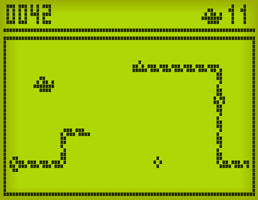

#  Snake

This the classic Snake game, implemented using Pygame and NumPy arrays.

I tried imitating the game Snake II of old Nokia phones.

You control the snake with the arrow keys
or by clicking / tapping the edges of the screen.

You can try it here: <https://carlescn.github.io/snake_game/>
(note: on this web version the beep sound doesn't play most of the times.
I'll have to figure it out.)

## To do

- Figure how the scoring system worked on Snake II.
- Figure out the frequency of the bonus on Snake II.
- Make a menu for selecting the speed.
- Fix the sound problem on the web version.
